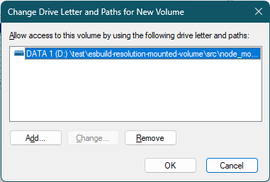
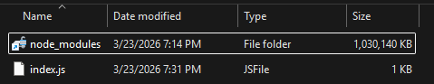

# esbuild-resolution-mounted-volume

This repo demonstrates that esbuild fails to resolve bare-specifier imports from `node_modules` folder when the target file is inside a
[Mounted Volume](https://learn.microsoft.com/en-us/windows-server/storage/disk-management/assign-a-mount-point-folder-path-to-a-drive)
(an NTFS junction pointing to a volume GUID path `\\?\Volume{...}\`).

## Prerequisites

* Windows with NTFS support (Windows XP or later)
* Node.js 20+
* Yarn (`npm install -g yarn`)
* A partition formatted with NTFS

## Preparation

1. Clone or download the repo onto an NTFS partition.
2. In the repo root, restore the dependency with:
    ```powershell
    yarn install
    ```
3. Create an _empty folder_ at `src/node_modules`. (Not the `node_modules` at repo root.)
4. [Mount a Volume to this empty folder](https://learn.microsoft.com/en-us/windows-server/storage/disk-management/assign-a-mount-point-folder-path-to-a-drive) using Disk Management.
    * You need to make sure the volume has no drive letter assigned to it.
    * [You can create a VHD file](https://learn.microsoft.com/en-us/windows-server/storage/disk-management/manage-virtual-hard-disks#create-a-vhd), create an empty partition, and mount it to the empty `node_modules` folder instead.

       

       
5. Create an empty file at `src/node_modules/foo.js` so it's actually created inside the mounted Volume.

## Reproduction

Run the build:

```powershell
yarn build
```

If `src/node_modules` is an ordinary folder, the output looks like this

```

  dist\out.js  15b 

⚡ Done in 4ms
```

The actual output was

```
✘ [ERROR] Could not resolve "foo"

    src/index.js:2:7:
      2 │ import 'foo';
        ╵        ~~~~~

  You can mark the path "foo" as external to exclude it from the bundle, which will remove this
  error and leave the unresolved path in the bundle.

1 error
node:child_process:964
    throw err;
    ^

Error: Command failed: ...\esbuild-resolution-mounted-volume\node_modules\@esbuild\win32-x64\esbuild.exe src/index.js --bundle --outfile=dist/out.js
    at genericNodeError (node:internal/errors:985:15)
    at wrappedFn (node:internal/errors:539:14)
    at checkExecSyncError (node:child_process:925:11)
    at Object.execFileSync (node:child_process:961:15)
    at Object.<anonymous> (...\esbuild-resolution-mounted-volume\node_modules\esbuild\bin\esbuild:222:28)
    at Module._compile (node:internal/modules/cjs/loader:1760:14)
    at Object..js (node:internal/modules/cjs/loader:1893:10)
    at Module.load (node:internal/modules/cjs/loader:1480:32)
    at Module._load (node:internal/modules/cjs/loader:1299:12)
    at TracingChannel.traceSync (node:diagnostics_channel:322:14) {
  status: 1,
  signal: null,
  output: [ null, null, null ],
  pid: 38472,
  stdout: null,
  stderr: null
}

Node.js v24.8.0
```
